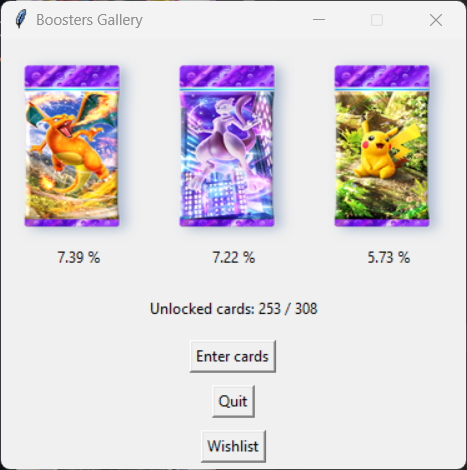
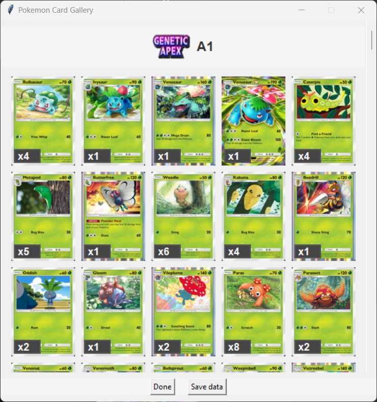
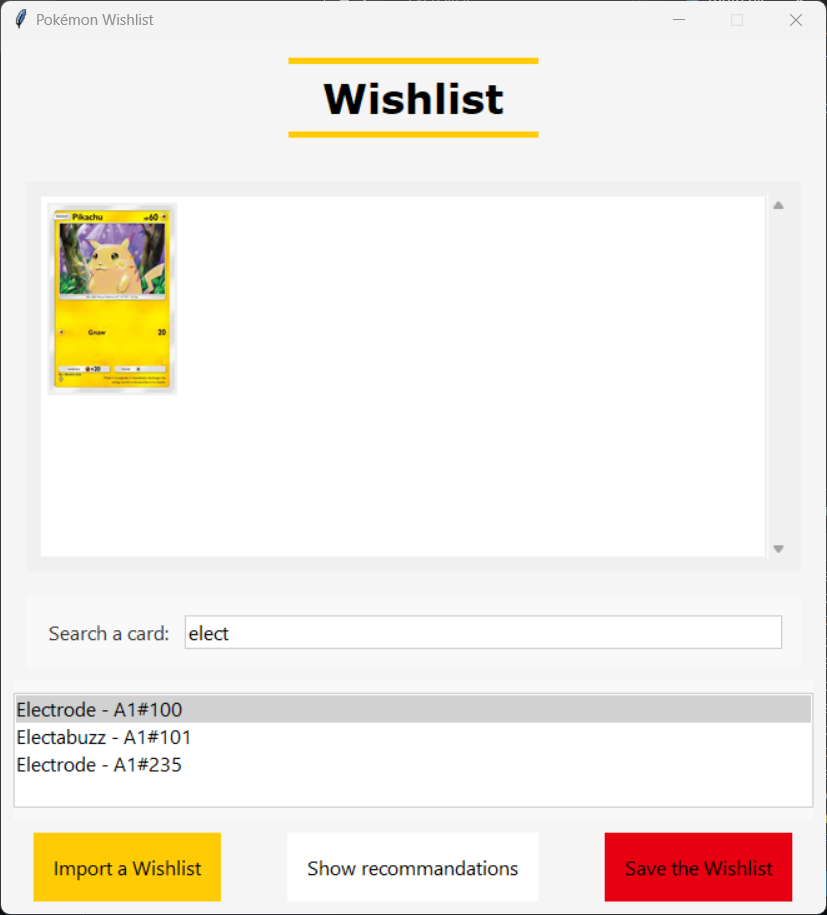
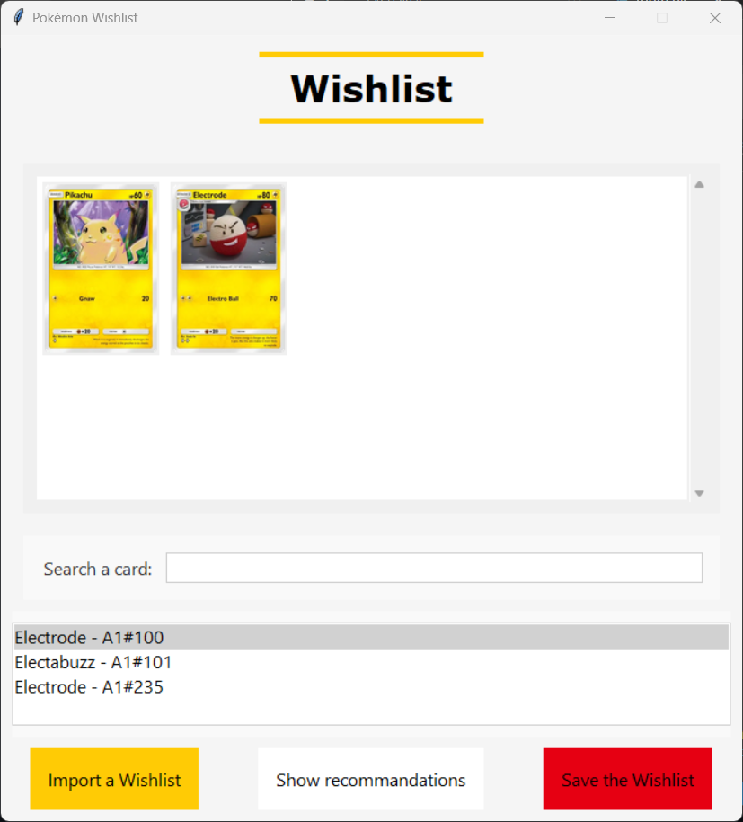
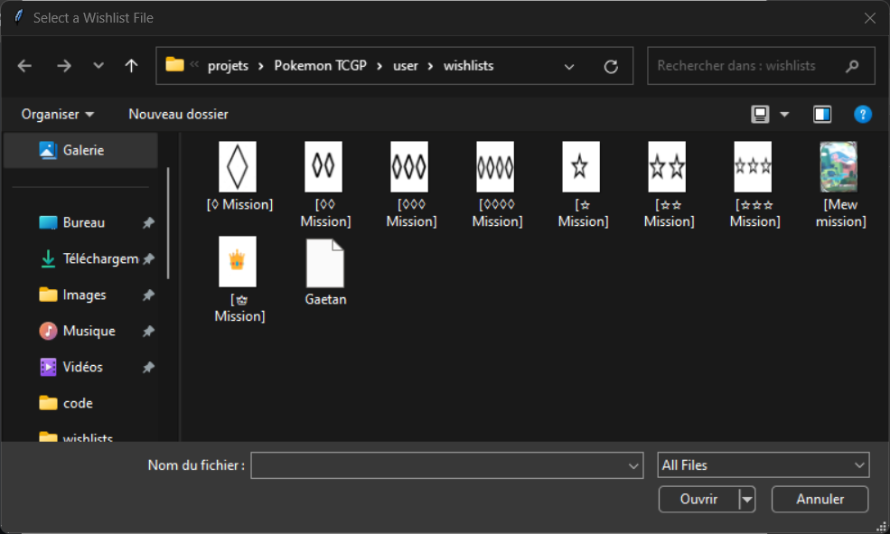
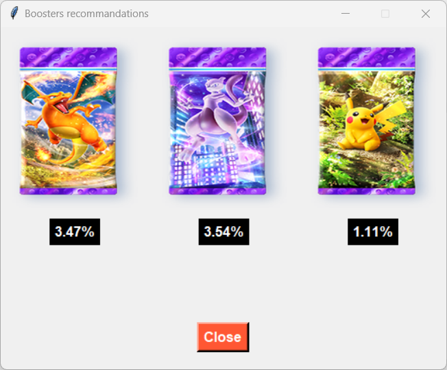

# Pokemon TCG Pocket collection tool

The goal of this program is to help the Pokemon TCGP players to optimize their cards collection.
Here is the main functionalities that has been released for now.

The probabilites of getting a new card is displayed for each pack, according to the cards that you own.
You can enter the cards you own by pressing the **Enter cards** button.

There are all the cards that are currently in game, in colors if owned, in grey if not.

By pressing a card, you can add it or remove it from your collection.

## Wishlists section

The goal of the wishlists is to create some sets of cards you need, for collection or combat purposes for instance.

You can add manually some cards by typing their name and selecting it.
You can remove a card from the wishlist by clicking on it.

You can save your wishlist at anytime, or import one of the preset wishlists.
They load all the cards you need to complete some missions (I've implemented the Mew mission and every rarity missions)

Once you have loaded a wishlist, you can generate the probabilities of getting its cards in every booster. 
(CAUTION: the shown probabilities are not the exact probabilities of getting a new card, I need to normalise the data, it's going to be fixed for the next release !)

Used languages: Python
Librairies: os, Tkinter, PIL, json, pandas, io, bs4, re, sys
